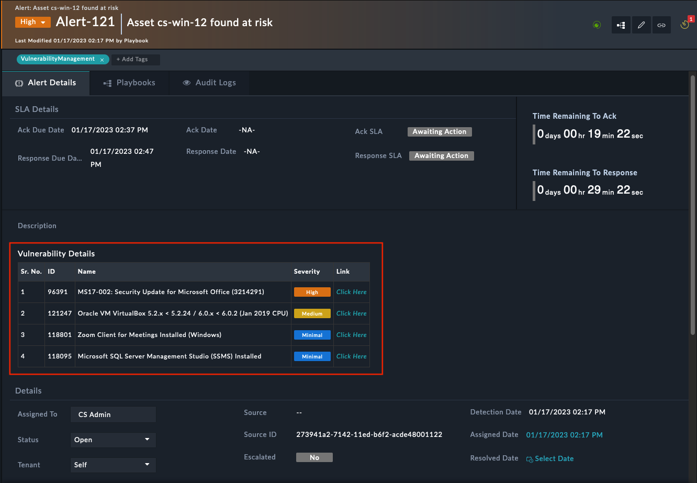
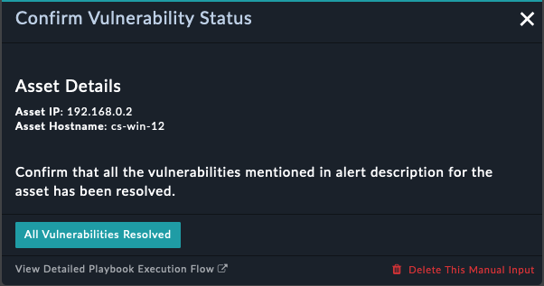

| [Home](../README.md) |
|----------------------|

# Usage

Refer to [Simulate Scenario documentation](https://github.com/fortinet-fortisoar/solution-pack-soc-simulator/blob/develop/docs/usage.md) to understand how to simulate and reset scenarios.

To understand the process FortiSOAR follows to manage vulnerabilities, we have included a scenario &mdash; **Vulnerability Management** &mdash; with this solution pack.

Refer to the section *Vulnerability Management* to understand how this solution pack's automation addresses your needs.

## Scenario

This scenario generates an example asset, scan, and some vulnerabilities.

Navigate to the generated scan and note the following:

The scan contains the following information

- Scan state
- Scan duration
- User's email address
- Asset details as a record

Navigate to the generated asset, within the scan, and note the following:

- Reported Asset contains the following among other information
    - Host Name
    - IP Address
    - MAC Address
    - Operating System
- Select the asset record to view the following information about the reported asset
    - Asset's Operating System
    - Asset's State
    - Asset's Status
    - Asset's Criticality
    - Asset's Risk

> **NOTE**: `Asset Criticality` signifies the importance or criticality of the asset to the organisation. However `Asset Risk` signifies the vulnerability of the asset based on the vulnerabilities found.

Navigate to the generated vulnerabilities and note the following about the scanned asset:

- Severity
- Status
- Risk and Risk score
- Exploits
- Exploit Skills

You can open each vulnerability to read the Description, Synopsis, and proposed solution for each.

Users can launch the **Get Vulnerability Details** playbook. This playbook performs the following automated tasks:

- Identifying the severity of the vulnerability
- Finding vulnerability count
- Getting synopsis, solution, plugin details, risk information, and reference information.

### High Vulnerability Response 

- On completion of ingestion for a particular scan, a response playbook is executed

- This playbook fetches the assets associated with scan and checks if the asset has critical or high vulnerability attached to it 

- An alert of the type `Vulnerable Asset` is created for such high-risk assets

- The newly created alert contains `Vulnerability ID`, `Vulnerability Name`, and `Vulnerability Record Link` in the description of the alert

    

    > In case, if the same asset is found in the next scan with added vulnerabilities, such vulnerabilities are appended to the existing alert description, and a comment is added

    > 

- A manual input is created for the alert showing pop-up as below
    
    

- Once all the vulnerabilities associated with the asset are resolved, click on the `All Vulnerability Resolved` button

    - This action unlinks all the vulnerabilities from the asset and closes the alert
